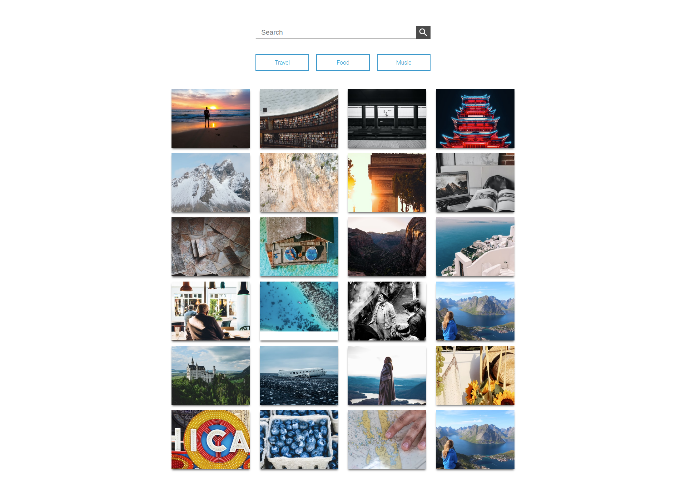

## Simple React Gallery App
The [React Gallery App](https://github.com/renatognunes/react-gallery-app) is simple web app that can search and display photo gallery, powered by [Unsplash API](https://unsplash.com/developers). 

### Runnig app locally
Sign up at [Unsplash API](https://unsplash.com/developers) and add it to .env file.

`REACT_APP_API_KEY=<YOUR_API_KEY>`

`npm install`

`npm start`

## Run in docker
1- `run_docker.sh` will beuind and run the application in Docker
`./run_docker.sh`

2- Test application 
    - http://localhost:3000/
    - `curl -s http://localhost:3000` (curl option)

3- Check the Docker logs for debug
`docker logs -f gallery-capstone-app`

4- Stop Docker container
`docker stop gallery-capstone-app`

## Tag and Upload Docker images to DockerHub
1- update `upload_docker.sh` with your Dockerhub account information, and run:
`upload_docker.sh`

- AWS AIM user
    name jenkins-capstone
    - "ec2:*"
    - "s3:*"
    - "cloudformation:*"