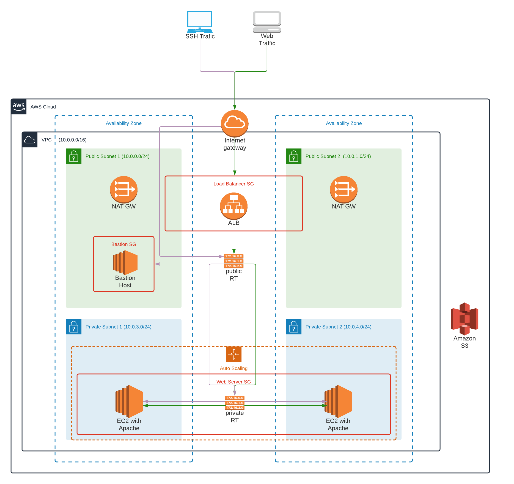

## Create Stack
* ./create.sh udemy-infra-stack private-network.yml private-network-parameters.json
* ./create.sh udemy-HA-stack ha-infrastructure.yml ha-infrastructure-parameters.json
* ./create.sh udemy-bastion-host-stack bastion-host.yml ha-infrastructure-parameters.json

## Update Stack
* ./update.sh udemy-infra-stack private-network.yml private-network-parameters.json
* ./update.sh udemy-HA-stack ha-infrastructure.yml ha-infrastructure-parameters.json
* ./update.sh udemy-bastion-host-stack bastion-host.yml ha-infrastructure-parameters.json

## Delete Stack
* ./delete.sh udemy-bastion-host-stack
* ./delete.sh udemy-HA-stack
* ./delete.sh udemy-infra-stack

## Diagram

## SSH into EC2
ssh -i EC2-KP.pem ec2-user@YOUR_Bastion_IP

## AWS components deployed and configured by CloudFormation templates
* VPC configured with public and private subnets across two Availability Zones.
* Elastic Load Balancer (ELB) attached to VPC.
* NAT gateways to allow outbound internet connectivity in the private subnets.
* Bastion host in public subnets to allow inbound Secure Shell (SSH) access.
* Security groups to restrict access to only necessary protocols and ports:
    * BastionSG (ssh - port:22)
    * WebServerSecGroup (http - port:80, ssh - port:22)
    * LBSecGroup (http - port:80)
* One EC2 instance of t3.small in each availability zone, with 10Gb of EBS volume.
* InstanceProfile to provide access to S3 from EC2 instances
* UserData script to install and configure Apache server and serve index.html

