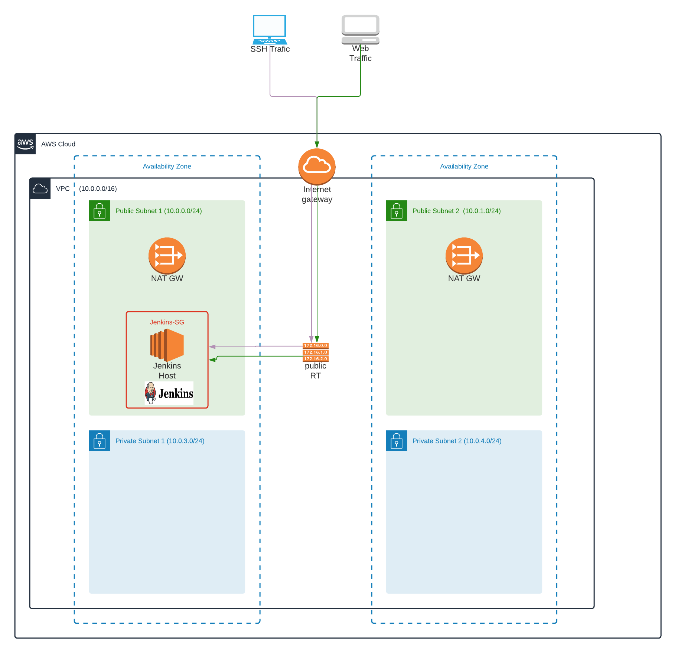

## Create Stack
* `./create.sh captsone-infra-stack private-network.yml private-network-parameters.json`
* `./create.sh captsone-jenkins-host-stack jenkins-host.yml jenkins-parameters.json`

## Update Stack
* `./update.sh captsone-infra-stack private-network.yml private-network-parameters.json`
* `./update.sh captsone-jenkins-host-stack jenkins-host.yml jenkins-parameters.json`

## Delete Stack
* `./delete.sh captsone-jenkins-host-stack`
* `./delete.sh captsone-infra-stack`

## Diagram

## SSH into EC2
`ssh -i EC2-KP.pem ec2-user@YOUR_jenkins_IP`

Get the initial password to proceed with the installation:

`cat /var/lib/jenkins/secrets/initialAdminPassword`

## AWS components deployed and configured by CloudFormation templates
* VPC configured with public and private subnets across two Availability Zones.
* NAT gateways to allow outbound internet connectivity in the private subnets.
* Jenkins host in public subnets.
* Security groups to restrict access to only necessary protocols and ports:
    * JenkinsSG (http - port:8080, ssh - port:22)
* One EC2 instance of t2.micro in each availability zone, with 10Gb of EBS volume.
* InstanceProfile to provide access to S3 from EC2 instances
* UserData script to install and configure Apache server and serve index.html

